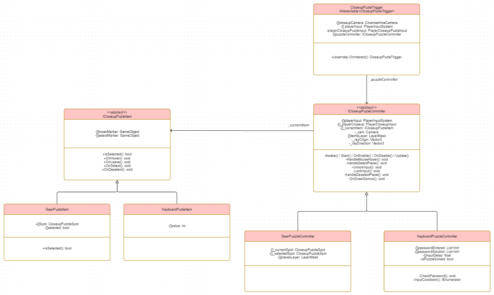

# Closeup Puzzles

Los puzles Closeup son los puzles donde la cámara se centra en el puzle y los controladores se centran en el puzle propio. Para ello, ocurre lo siguiente:
- Heredan de `ICloseupPuzleController`
- Se utiliza el Input de Closeup en lugar del Locomotion
- Se cambia la cámara del personaje para una cámara centrada en el puzle para el control específico

Estos puzles empiezan cuando el jugador interactua con un objeto que contenga el `CloseupPuzleTrigger`, el cual cambiará la cámara del jugador a la cámara del puzle. Podrá salir de este modo en cualquier momento. 

Los puzles Closeup funcionan interactuando con objetos que hereden de `CloseupPuzleItem`, siendo el objeto con el que se esté interactuando el atributo `_currentItem`.

Los tipos de puzles Closeup desarrollados actualmente son los siguientes:

## Gear Puzzle
Este puzle consiste en colocar los engranajes/gears en su sitio/Spot correspondiente. Los engranajes solo se pueden mover a sitios adyacentes no ocupados.

La implementación de su controlador es `GearPuzleController` y los objetos son `GearPuzleItem`, además de la clase adicional `CloseupPuzleSpot` para los sitios de los engranajes. 

El funcionamiento consiste en la selección de uno de los engranajes, el cual se mantendrá seleccionado hasta que se deseleccione. A partir de estar seleccionado, el jugador podrá seleccionar los sitios para mover el engranaje.

## Keyboard Puzzle
Este puzle consiste en un teclado numérico donde introducir una contraseña correcta. También cuenta con una tecla adicional para borrar la contraseña que se esté introduciendo.

La implementación de su controlador es `KeyboardPuzleController` y los objetos son `KeyboardPuzleItem`, que cumplirán el papel de teclas del teclado. La contraseña correcta es introducida por el ScriptableObject `PasswordData` de Assets/GameData. El objeto con la contraseña se almacenará en la carpeta Assets/Scripts/CloseupPuzle.

El funcionamiento consiste en la interacción con cada uno de los items/teclas para introducir su valor. La longitud de la contraseña a introducir dependerá de la longitud de la contraseña y la contraseña introducida podrá ser borrada por una tecla adicional, cuyo valor es -1.

# Diagrama UML
Los diagramas sobre la implementación actual de los componentes de los puzles Closeup son los siguientes:

